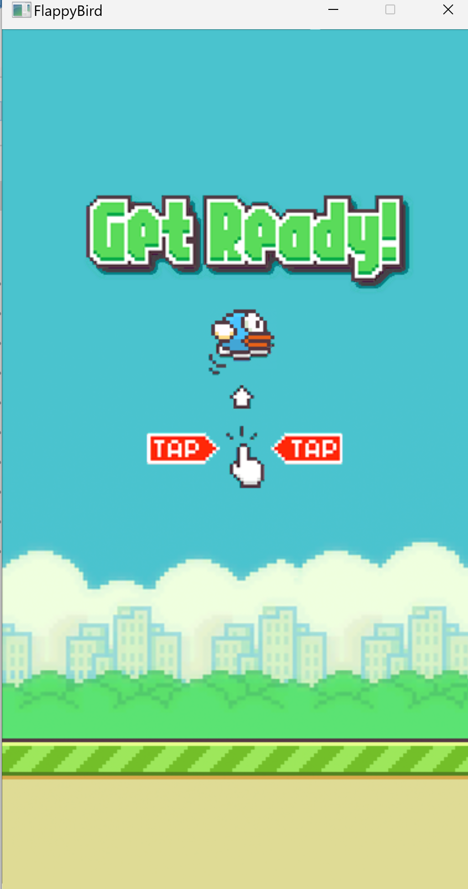
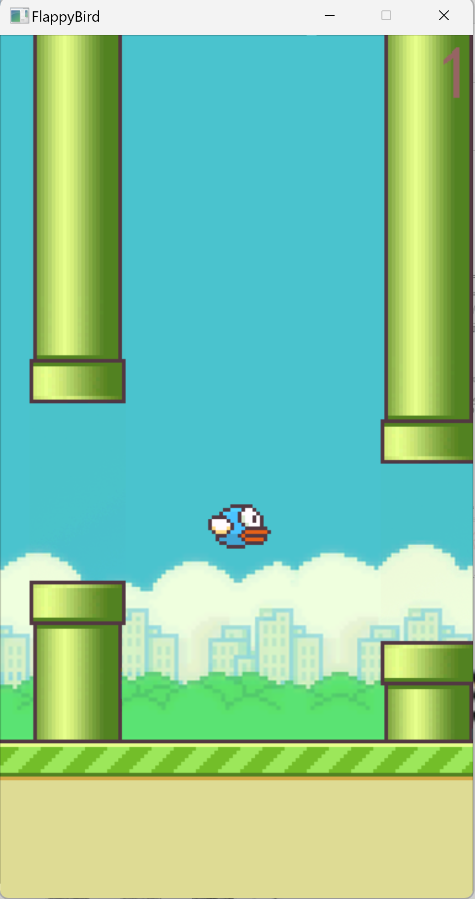
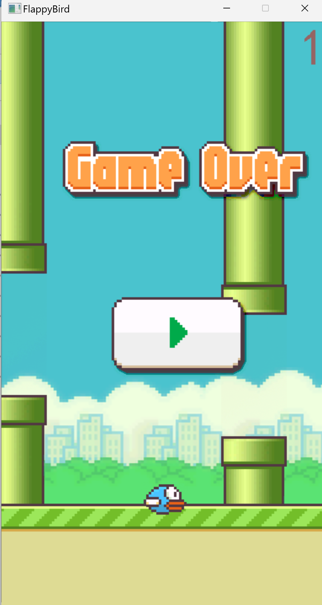

# 🐦 Flappy Bird - EasyX Edition

<div align="center">


一个基于 EasyX 图形库的 Flappy Bird 游戏实现，使用面向对象编程思想，适合 C++ 初学者学习游戏开发。

[功能特性](#功能特性) • [快速开始](#快速开始) • [编译指南](#编译指南) • [游戏说明](#游戏说明) • [项目结构](#项目结构)

</div>

---

## 📸 游戏截图

<div align="center">

| 开始界面 | 游戏中 | 游戏结束 |
|:------:|:------:|:------:|
|  |  |  |

</div>

---

## ✨ 功能特性

### 🎮 核心玩法
- **经典 Flappy Bird 体验**：控制小鸟穿越管道障碍物
- **物理引擎**：重力模拟、速度加速、抛物线运动轨迹
- **碰撞检测**：精确的 AABB 矩形碰撞检测
- **计分系统**：实时分数显示与最高分记录

### 🚀 增强功能
本项目在原版基础上增加了丰富的游戏机制：

| 特性 | 说明 |
|------|------|
| **完美穿越** | 从管道缝隙正中间穿过，获得额外加分，连续完美有连击奖励 |
| **惊险穿越** | 差一点就碰到管道边缘，也能获得加分 |
| **Fever 模式** | 连续穿过 10 根管道不死亡，进入双倍得分模式 |
| **护盾道具** | 地图上出现的黄色圆圈，吃到后可以抵挡一次碰撞 |
| **金币道具** | 收集金币，在商店购买永久升级 |
| **二段跳道具** | 临时获得更强的跳跃能力 |
| **随机道具** | 无敌(Ghost)、缩小(Shrink)、减速(SlowMo)、双倍(2X) |
| **商店系统** | 永久升级：开局护盾、完美窗口加大、二段跳增强 |
| **难度递增** | 分数越高，管道移动越快，生成越频繁 |
| **移动管道** | 25% 概率生成会上下移动的管道 |
| **最高分记录** | 保存到文件，关闭游戏后不丢失 |

---

## 🚀 快速开始

### 方法一：直接运行（推荐）

1. 克隆仓库到本地
   ```bash
   git clone https://github.com/你的用户名/Flappy-Bird-EasyX.git
   ```

2. 进入项目目录，双击 `FlappyBird.exe` 即可开始游戏

**前提条件**：
- Windows 系统
- `res/` 文件夹和 `.exe` 文件在同一目录

### 方法二：从源码编译

详见 [编译指南](#编译指南)

---

## 🎮 游戏说明

### 基本操作
- **鼠标左键点击** 或 **空格键**：让小鸟拍翅膀向上飞
- **ESC 键**：暂停/继续游戏
- **R 键**：重新开始游戏

### 游戏规则
1. 小鸟会受到重力影响自动下落
2. 点击屏幕让小鸟向上飞
3. 避开上下管道和地面
4. 每穿过一对管道得 1 分
5. 碰撞后游戏结束

### 进阶技巧
- **完美穿越**：从管道正中间穿过可获得额外加分
- **惊险穿越**：贴近管道边缘穿过也能加分
- **收集道具**：护盾、金币、随机道具助你获得更高分
- **商店升级**：用金币购买永久升级，提升游戏体验

---

## 🛠️ 技术栈

- **编程语言**：C++ (面向对象编程)
- **图形库**：[EasyX](https://easyx.cn/) (Windows 平台)
- **开发工具**：Visual Studio 2022
- **核心概念**：
  - 面向对象编程 (OOP)
  - Win32 消息机制
  - 游戏状态机
  - 定时器系统
  - 双缓冲绘制
  - 透明贴图技术

---

## 📁 项目结构

```
Flappy-Bird-EasyX/
│
├── GameFrame/                  ← 【骨架】程序入口 + 游戏框架基类
│   ├── main.cpp                    程序从这里开始运行
│   └── frame.h                     游戏框架的「设计图纸」（抽象基类）
│
├── GameConfig/                 ← 【配置】所有魔法数字的定义
│   └── GameConfig.h                窗口大小、图片尺寸、定时器间隔、物理参数...
│
├── BirdAPP/                    ← 【大脑】核心游戏逻辑
│   ├── CBirdAPP.h                  游戏类的声明（有哪些变量和方法）
│   └── CBirdAPP.cpp                游戏类的实现（所有游戏逻辑）
│
├── PlayerBird/                 ← 【角色】小鸟
│   ├── CPlayerBird.h
│   └── CPlayerBird.cpp             小鸟的位置、速度、重力、动画、渲染
│
├── Column/                     ← 【障碍】管道
│   ├── CColumn.h / .cpp            单根管道：位置、移动、碰撞检测
│   └── CColumnBox.h / .cpp         管道容器：管理所有管道的生命周期
│
├── BackGround/                 ← 【背景】静态背景图
│   ├── CBackGround.h
│   └── CBackGround.cpp
│
├── Ground/                     ← 【地面】滚动的地面
│   ├── CGround.h
│   └── CGround.cpp                 地面滚动 + 接触检测
│
├── BeforeGame/                 ← 【界面】开始画面
│   ├── BeforeGame.h
│   └── BeforeGame.cpp
│
├── AfterGame/                  ← 【界面】结束画面
│   ├── CAfterGame.h
│   └── CAfterGame.cpp
│
├── res/                        ← 【资源】所有图片素材
│   ├── 0.png ~ 7.png               小鸟动画（遮罩层）
│   ├── 0Front.png ~ 7Front.png     小鸟动画（颜色层）
│   ├── background.png              背景图
│   ├── ground.png                  地面图
│   ├── column.png / columnFront.png 管道图
│   ├── start.png / startFront.png  开始画面
│   └── gameover.png / gameoverFront.png 结束画面
│
├── picture/                    ← 【文档】README 用图
│   ├── start.png
│   ├── gaming.png
│   ├── over.png
│   └── ClassMap.jpg               类图
│
├── best_score.txt              ← 最高分记录
├── player_save.txt             ← 玩家存档（金币、升级）
├── FlappyBird.exe              ← 编译好的可执行文件
├── README.md                   ← 项目说明文档
├── TUTORIAL.md                ← 详细教程文档
└── LICENSE                     ← 开源许可证
```

### 架构设计

本项目采用 **框架模式** 和 **面向对象设计**：

```
CGameFrame (框架基类)
    ↓ 继承
CBirdAPP (具体游戏实现)
    ├── CBackGround (背景)
    ├── CGround (地面)
    ├── CPlayerBird (小鸟)
    ├── CColumnBox (管道容器)
    │     └── CColumn (单根管道)
    ├── CBeforeGame (开始画面)
    └── CAfterGame (结束画面)
```

**设计原则**：
- 单一职责原则：每个类只负责一件事
- 组合优于继承：CBirdAPP 拥有各个组件，而不是继承它们
- 框架与实现分离：通用逻辑在框架层，具体逻辑在实现层

---

## 🔧 编译指南

### 环境要求

- **操作系统**：Windows 7 及以上
- **编译器**：Visual Studio 2019 或更高版本
- **图形库**：EasyX 2023 或更高版本

### 详细步骤

#### 步骤 1：安装 Visual Studio

下载 [Visual Studio 2022 Community](https://visualstudio.microsoft.com/)（免费），安装时勾选 **「使用 C++ 的桌面开发」** 工作负载。

#### 步骤 2：安装 EasyX

访问 [EasyX 官网](https://easyx.cn/)，下载安装程序。它会自动集成到 Visual Studio 中。

#### 步骤 3：创建项目

1. 打开 Visual Studio → 创建新项目 → 选择 **「空项目」**
2. 项目名称：`FlappyBird`
3. 平台：`x86`（32 位）

#### 步骤 4：添加源文件

将项目中所有 `.cpp` 和 `.h` 文件添加到项目中：

```
GameFrame/main.cpp
GameFrame/frame.h
GameConfig/GameConfig.h
BirdAPP/CBirdAPP.h
BirdAPP/CBirdAPP.cpp
PlayerBird/CPlayerBird.h
PlayerBird/CPlayerBird.cpp
Column/CColumn.h
Column/CColumn.cpp
Column/CColumnBox.h
Column/CColumnBox.cpp
BackGround/CBackGround.h
BackGround/CBackGround.cpp
Ground/CGround.h
Ground/CGround.cpp
BeforeGame/BeforeGame.h
BeforeGame/BeforeGame.cpp
AfterGame/CAfterGame.h
AfterGame/CAfterGame.cpp
```

#### 步骤 5：设置工作目录

项目属性 → 调试 → 工作目录 → 设置为项目根目录（包含 `res/` 的那个目录）。

#### 步骤 6：编译运行

按 `F5` 或点击 **「本地 Windows 调试器」**。

---

## 🎓 学习资源

本项目配有 **超详细的中文教程文档** [TUTORIAL.md](TUTORIAL.md)，包含：

- 项目全景与技术栈科普
- 代码结构与设计哲学
- 游戏物理与动画实现
- 碰撞检测与计分系统
- 道具系统与商店系统
- 渲染技巧与透明贴图
- 从零开始的理解指南

**适合人群**：
- C++ 初学者
- 游戏开发入门者
- 想要理解面向对象编程的学生
- 对 EasyX 图形库感兴趣的学习者

---

## 🔬 实验与修改

编译成功后，试着修改这些参数来理解代码：

```cpp
// GameConfig.h —— 试试改这些值：

// 改变窗口大小
#define IMG_BACKGROUND_WIDTH 600       // 改大一点会怎样？
#define IMG_BACKGROUND_HEIGHT 900

// 改变物理参数
#define BIRD_STARTSPEED -15           // 飞得更高？
#define BIRD_A 2                     // 重力更大？
#define BIRD_MAX_DOWN_SPEED 20        // 下落更快？

// 改变定时器间隔
#define TIMER_GROUND_MOVE_INTERVAL 10 // 移动更快？
#define TIMER_BIRD_POSITION_INTERVAL 60 // 物理更新更慢？
```

**建议实验顺序**：

1. 先改 `BIRD_STARTSPEED` 为 `-20`，感受一下超强弹跳
2. 改 `BIRD_A` 为 `3`，感受重力变强
3. 改 `TIMER_GROUND_MOVE_INTERVAL` 为 `10`，感受加速世界
4. 尝试修改 `CColumn::InitColumn()` 中的概率，让所有管道都变成移动管道

---

## 🤝 贡献指南

欢迎贡献代码、提出建议或报告问题！

### 如何贡献

1. Fork 本仓库
2. 创建你的特性分支 (`git checkout -b feature/AmazingFeature`)
3. 提交你的更改 (`git commit -m 'Add some AmazingFeature'`)
4. 推送到分支 (`git push origin feature/AmazingFeature`)
5. 打开一个 Pull Request

### 报告问题

如果你发现任何 bug 或有改进建议，请打开一个 [Issue](https://github.com/你的用户名/Flappy-Bird-EasyX/issues)。

---

## 📄 许可证

本项目采用 MIT 许可证 - 查看 [LICENSE](LICENSE) 文件了解详情。

---

## 🙏 致谢

- **Dong Nguyen**：原版 Flappy Bird 游戏的创作者
- **EasyX 团队**：提供优秀的 C++ 图形库
- **所有贡献者**：让这个项目变得更好

---

## 📧 联系方式

如果你有任何问题或建议，欢迎通过以下方式联系：

- 打开一个 [Issue](https://github.com/你的用户名/Flappy-Bird-EasyX/issues)
- 发送邮件至：[你的邮箱]

---

<div align="center">

**⭐️ 如果这个项目对你有帮助，请给它一个星标！⭐️**

Made with ❤️ by [nuist-521]

</div>
